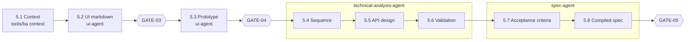

# How the BA workflow runs

This is the human-readable companion to [workflow.yaml](workflow.yaml), which is the definition the tools actually read. Background: [master spec](../../docs/master-spec.md) and [implementation decisions](../../docs/implementation-decisions.md).

## The idea in one paragraph

Every step reads defined inputs and writes a defined artifact. Every artifact records the exact inputs it was built from (`built_from` with content hashes). Humans approve at gates, and an approval is tied to the exact content approved. The workflow's position is never stored as "where we were". `tools/ba` **derives** it from which artifacts exist, whether they are stale or invalid, and what each gate says. That is why it can stop and resume anywhere, including in a brand-new session.

## Routes

| Mode | When | Route (M1 engine in **bold**) |
|---|---|---|
| MODE_A | Existing product | Reverse engineering → GATE-01 → Tech baseline → GATE-09 → Elicitation → Overview → GATE-02 → Planning → **Spec Engine** → GATE-06 → Coding → GATE-10 → QA → GATE-07 → User guide → GATE-08 |
| MODE_B | New product / large change | Elicitation → Overview → **GATE-02** → Tech baseline → **GATE-09** → Planning → **Spec Engine** → GATE-06 → … |
| MODE_C | Small change request | CR intake → Impact analysis → **Spec Engine (updates)** → GATE-06 → … |

The template starts with one MODE_B run (RUN-001). Milestone 1 has no engine for the overview or the technical baseline, so they are written by hand. Once they exist, the first real step is approving GATE-02 and GATE-09.

## Spec Engine (per use case)

A use case starts only when GATE-02 and GATE-09 are approved, its backlog status is READY, and the use cases it depends on have GATE-05 approved. Independent use cases run in parallel.

## How `tools/ba next` decides a use case's next action

For each step 5.2 → 5.8, in order:

1. The artifact is missing → **GENERATE**.
2. An input it was built from changed → **REGENERATE** (only what the change affects).
3. It fails validation → **FIX**.
4. The step ends at a gate:
   - no request yet, or the content changed since → **REQUEST_GATE**;
   - request open → **WAITING** for the human;
   - changes requested → **REVISE** with the reviewer's comments;
   - approved → continue to the next step.

Reviewer comments stay attached to the actions until the gate is requested again.

## Gate states

| State | Meaning |
|---|---|
| NOT_REQUESTED | No review requested yet |
| WAITING | Requested; the artifacts are exactly as submitted |
| APPROVED | Approved, and the content and its inputs are unchanged since |
| CHANGES_REQUESTED | Reviewer asked for changes; artifacts not yet revised |
| OUTDATED | Artifacts changed after the request/decision; needs a new request |
| INVALIDATED | Was approved, but the content or one of its inputs changed since |
| BLOCKED | Reviewer blocked it (reserved for GATE-06) |

Only content counts. Updating `status`, `review`, `version`, `updated_at` or `built_from` never changes a hash. So re-stamping an artifact whose content didn't change keeps its approval.

## Who writes what

| File | Written by |
|---|---|
| Use-case artifacts (`ui/`, `technical/sequence|api/<UC>.md`, `specifications/`) | The agent working on that use case |
| Catalogs (`overview/*.yaml`, `ui/screen-catalog.yaml`, `technical/api/api-catalog.yaml`, open questions, assumptions) | `tools/ba catalog add|update` only (locked) |
| `workflow/state.json`, backlog status fields, `knowledge/*` | `tools/ba sync` only |
| `reviews/requests/` | `tools/ba gate request` |
| `reviews/decisions/` | The UserPromptSubmit hook when the human types `/ba-approve` or `/ba-changes` (or `tools/ba decide` in the human's own terminal) |
